# DYWorker

DYWorker 是一款本地运行的 AI 工作助手。选择一个文件夹作为工作区，用自然语言描述目标，助手就会自己拆解步骤、逐步执行：读资料、理内容、写文档、做表格、操作办公软件，并在有风险的操作前先请求确认。所有数据都留在本机，不上传云端。

本仓库只保留当前 Electron + React + TypeScript 桌面版，不包含旧 Qt/C++ 版本、历史构建产物和在线原型托管代码。


## 核心能力

### 📁 以工作区为中心的任务对话

选择一个文件夹作为工作区，用自然语言描述目标。助手会自动拆解步骤、逐步执行；任务历史、执行过程和工作区文件随时可浏览、可追溯。

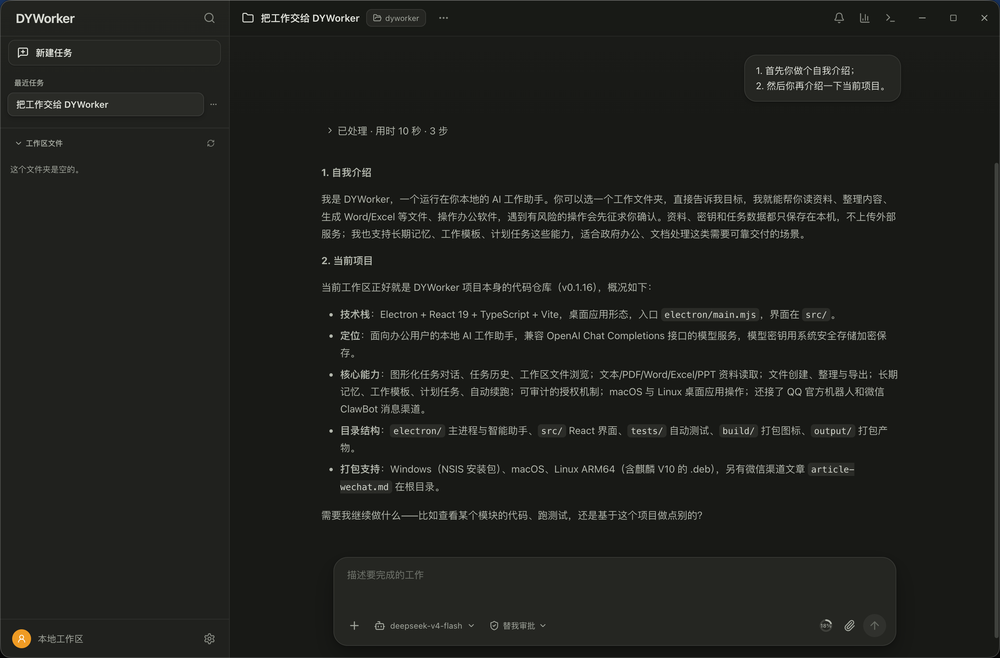

### 📄 办公全家桶读写与文件生成

文本、PDF、Word、Excel、PPT 都能读取；还能直接创建和导出 Word 文档、Excel 表格——不是给一段文本让你自己贴，而是把真实文件生成到工作区里。回答中还支持图表、步骤条等可视化展示，便于对比和决策。

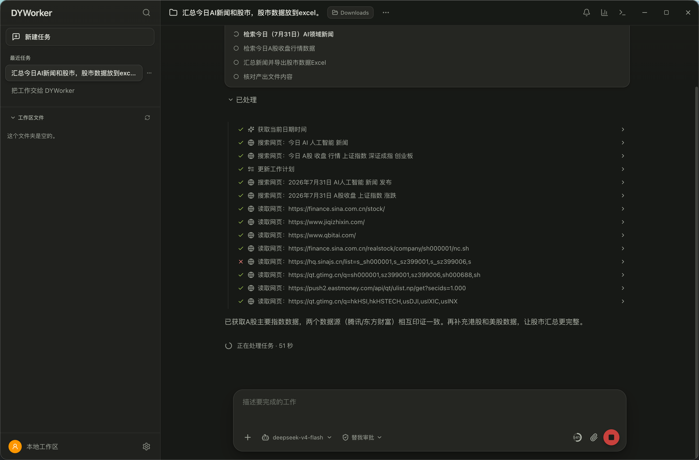

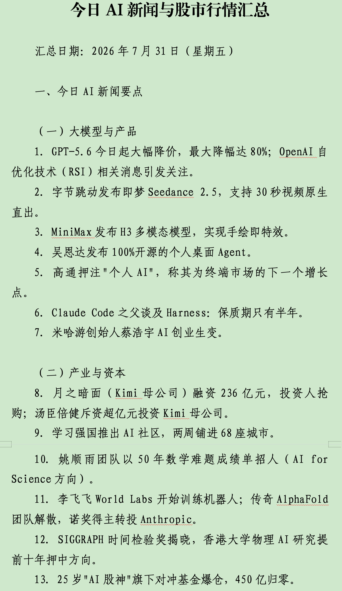

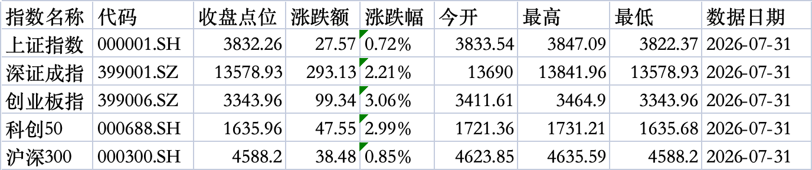

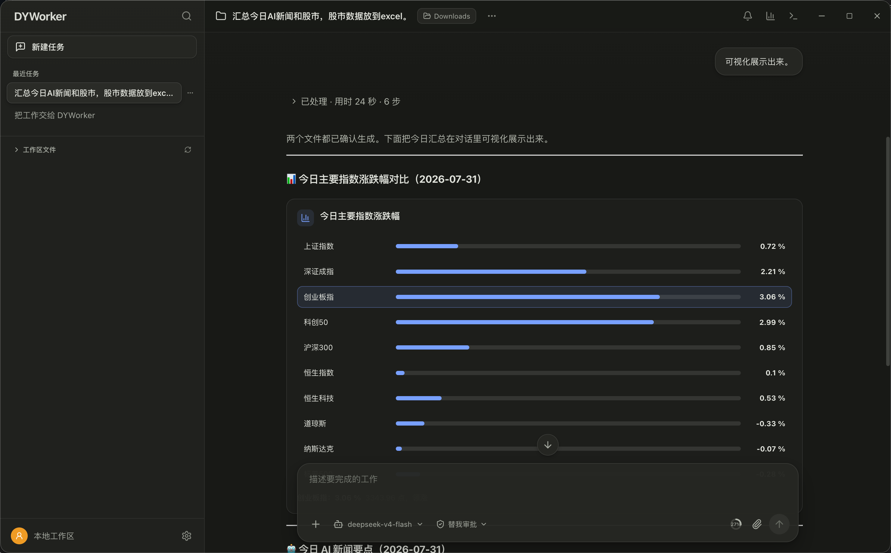

### 🧠 长期记忆 + 工作模板 + Skills

告诉它一次"我们单位的公文格式要求"，它就记住了。记忆分为偏好、规则、禁忌、事实、经验五类，可以全局通用，也可以只属于某个工作区。常用任务还能沉淀为**工作模板**，下次一键复用；同时支持安装 Skills 技能包，扩展专项能力。

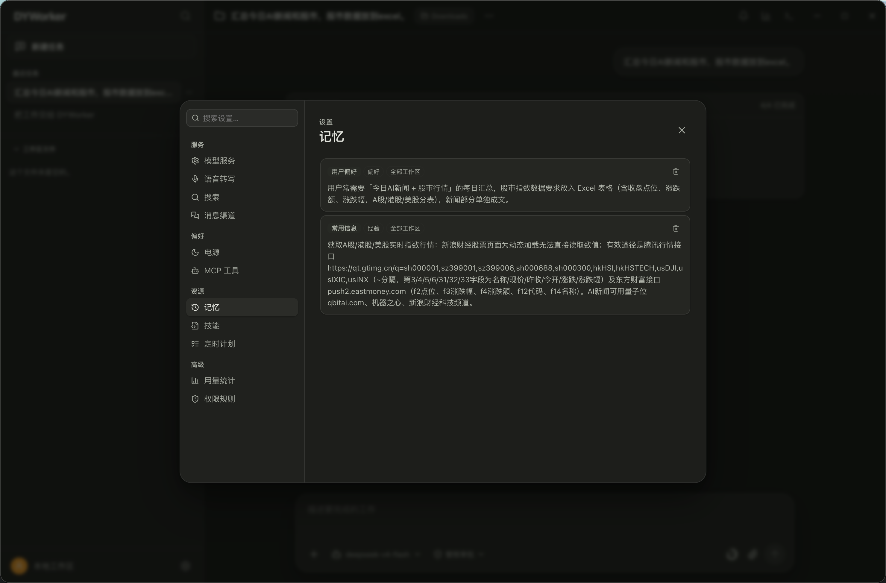

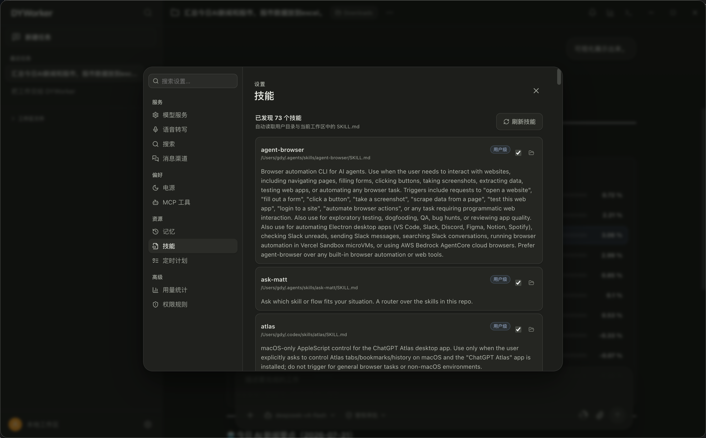

### ⏰ 计划任务与自动续跑

长任务不用守着：支持定时唤醒（1 分钟到 12 小时），任务中断后自动续跑，像同事一样"记着把事情做完"。

### 🔌 开放模型接入

兼容常见的 **OpenAI Chat Completions 和 Responses API**，已内置 DeepSeek V4 Flash，支持多套模型配置自由切换——DeepSeek、通义、智谱，或是单位内网自建的模型服务，填上地址和密钥就能用。密钥通过**系统安全存储加密保存**，绝不明文落盘。

DeepSeek V4 Flash 选择后也可以处理图片：在模型设置中填写一个支持图片的 OpenAI 兼容视觉服务地址、模型名称和密钥。DYWorker 会先让视觉服务把图片转换成描述，再交给 DeepSeek V4 Flash 继续分析；原图不会直接发送给纯文字接口。

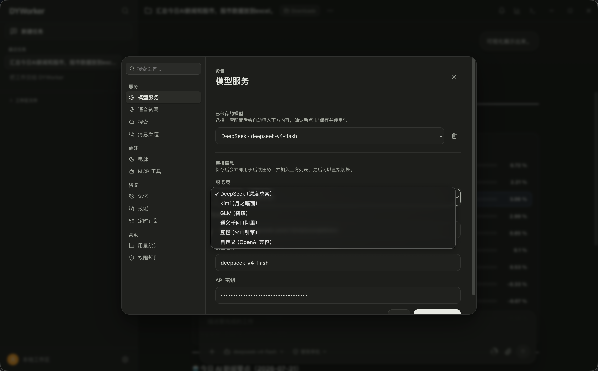

### 💬 QQ / 微信消息渠道

不在电脑前也能远程派活、收结果：支持接入 **QQ 官方机器人**和**微信 ClawBot**，手机上发消息即可。

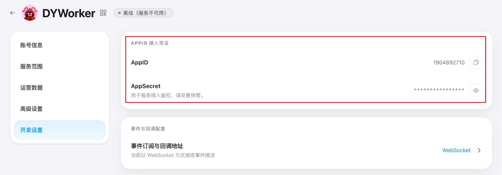

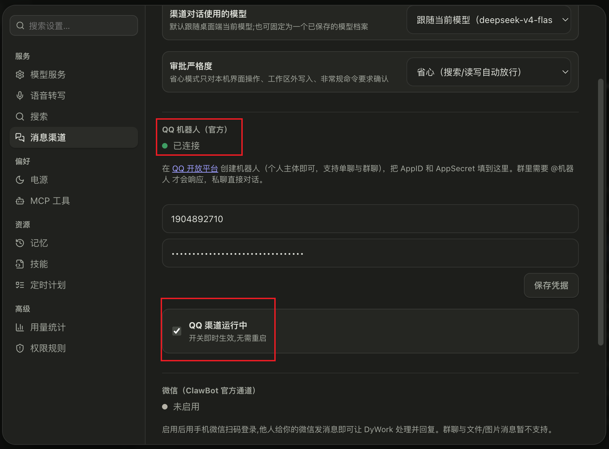

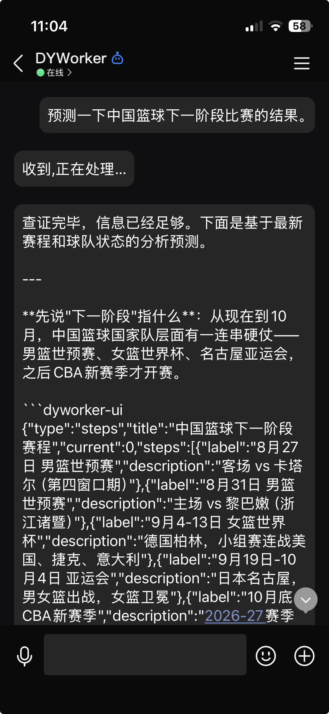

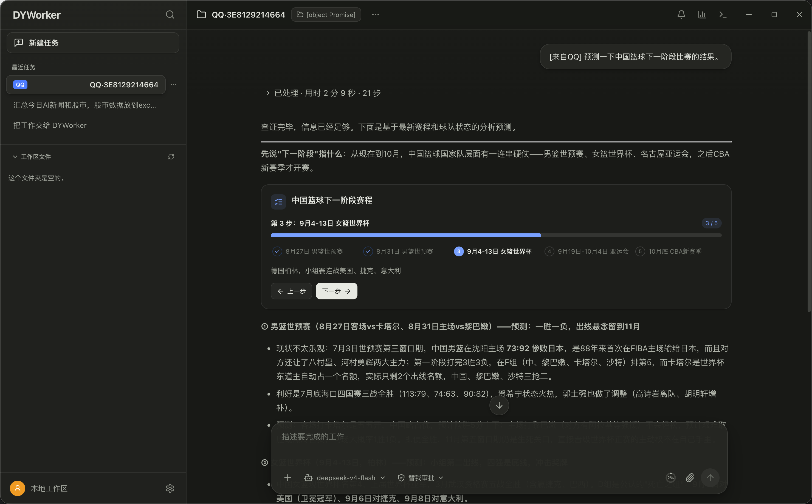

### 🖥️ 本机操作与国产化支持

- 可以操作 macOS、Linux 桌面上的应用：激活窗口、点击、输入文字，让 AI 从"动口"变成"动手"。
- 原生支持麒麟 V10（ARM64）和 UOS：一条命令打出 `.deb` 安装包，直接安装。
- 首次使用可一键"检查并安装本机操控环境"，缺什么组件自动补装（安装前请求系统授权）。
- 系统级能力通过 systemd-logind / freedesktop D-Bus 对接，麒麟/UOS 上尽力支持，不支持时静默降级，不会报错崩溃。

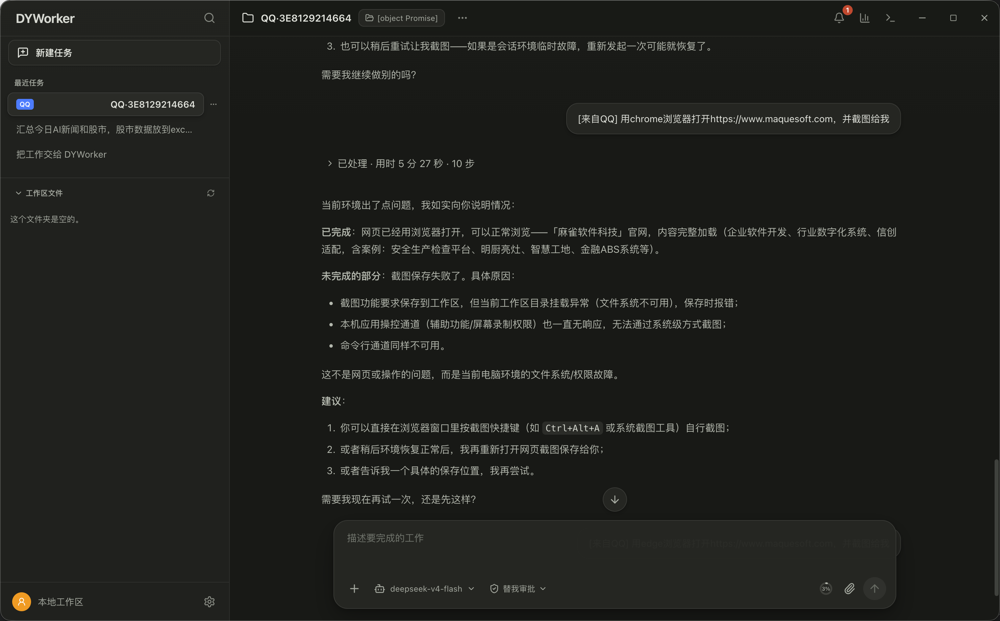

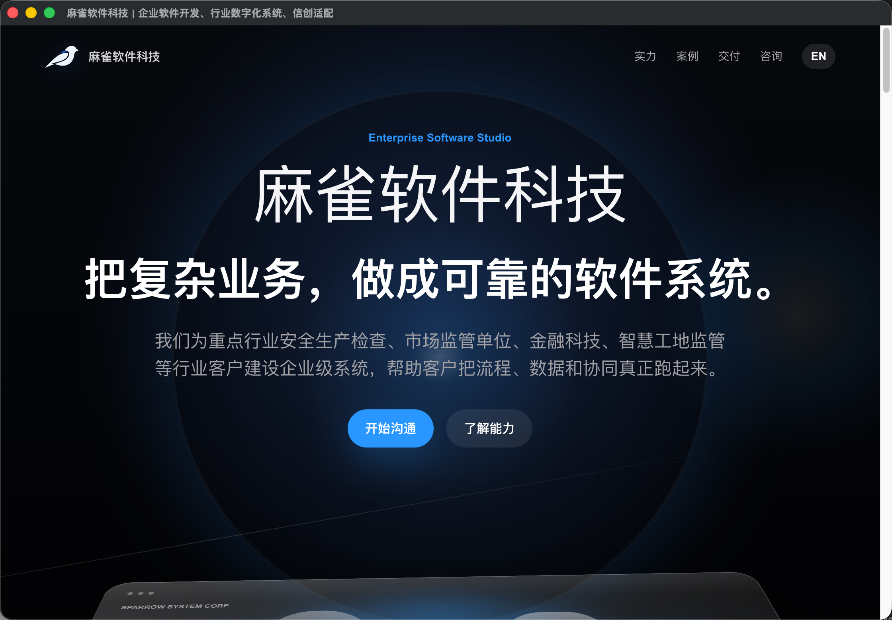

### 🛡️ 安全：全程可审计，关键操作必确认

- 风险命令和本机界面修改会先弹窗确认；
- 工作区外路径显示完整位置，单次操作单次授权；
- 文件、命令、联网、外部工具调用全部留痕；
- 密钥、登录凭据和任务数据只保存在本机用户数据目录。

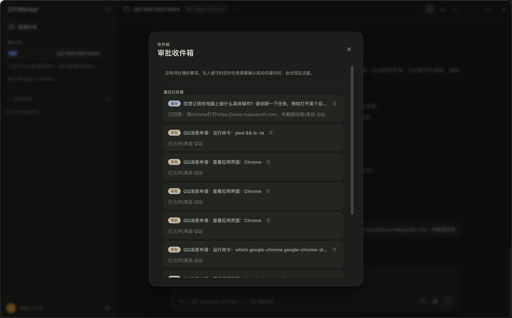

## 快速开始

**环境要求**：Node.js 22+、npm 10+；支持 macOS、Windows 10/11、常见 Linux 桌面（含麒麟 V10）。

```bash
npm ci
npm run dev:electron
```

只启动网页界面：

```bash
npm run dev
```

首次启动时先选择“通用身份”或“政府单位”，之后打开“设置”填入模型服务地址、模型名称和密钥，就可以开始派活；使用 DeepSeek V4 Flash 看图时，再按设置页提示补充视觉服务信息。身份也可以在设置中随时修改。

## 打包发布

打包前会自动执行构建和全部测试。

| 平台 | 命令 | 产物 |
| --- | --- | --- |
| Windows x64 | `npm run package:windows:x64` | setup.exe（按当前用户安装，免管理员权限） |
| macOS | `npm run package:mac` | 应用目录（当前架构） |
| Linux ARM64 / 麒麟 V10 | `npm run package:linux:arm64` | `.deb` 安装包 |

产物统一位于 `output/electron/`。

- **Windows**：推荐在 Windows 10/11 的 PowerShell 中执行 `npm ci && npm run package:windows:x64`。未签名的安装程序可能触发 SmartScreen 提示，正式公开发布时建议配置 Windows 代码签名证书后再打包（证书和密码不要写入仓库）。
- **macOS**：`npm run package:mac` 使用当前 Mac 的处理器架构生成未压缩应用目录。
- **Linux ARM64 / 麒麟 V10**：`npm run package:linux:arm64` 生成 `.deb` 安装包。桌面操控建议使用 X11 会话；Wayland 下应用会提示切换。首次使用时可在应用中执行"检查并安装本机操控环境"，按提示安装缺少的系统组件。
- 最可靠的发布方式是在对应系统上打包：Windows 包在 Windows 上生成，macOS 包在 macOS 上生成，Linux 包在 Linux 上生成。

如需在 macOS 或 Linux 上交叉生成 Windows 安装程序，可使用 electron-builder 官方的 Wine Docker 镜像：

```bash
docker run --rm -it \
  --platform linux/amd64 \
  -v "$PWD:/project" \
  -w /project \
  electronuserland/builder:wine \
  /bin/bash -lc "npm ci && npm run package:windows:x64"
```

## 检查代码

```bash
npm test        # 运行全部自动测试
npm run build   # 类型检查并生成正式页面
npm run verify  # 构建 + 全部测试一次完成
```

## 项目结构

```text
build/             打包图标
docs/screenshots/  界面截图
electron/          桌面主进程、智能助手、渠道和本机能力
src/               React 界面
tests/             自动测试
index.html         页面入口
package.json       项目命令和打包配置
```

## 参与开发

提交改动前请至少运行 `npm run verify`。修复问题时请补充能够复现问题的自动测试。不要提交 `node_modules/`、`dist/`、`output/`、`.env`、证书、私钥、模型密钥或任何真实密钥。

## 开源许可证

本项目使用 [MIT License](LICENSE)。
