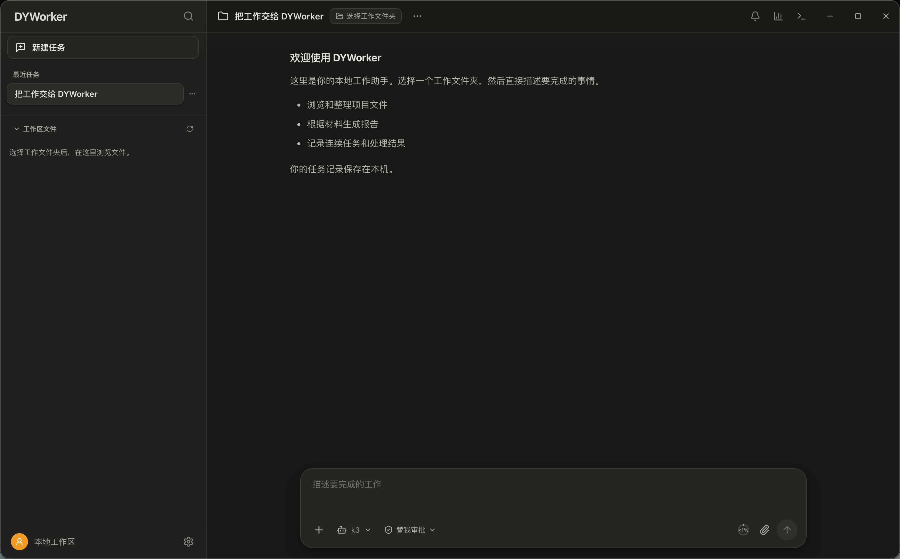

[English](./dyworker.md) | [简体中文](./dyworker.zh-CN.md) · [← Back](../README.md)

# 集成 DYWorker

DYWorker 是一款面向日常办公场景的本地 AI 工作助手。选择一个文件夹作为工作区，用自然语言描述目标，助手便会拆解任务并逐步执行——读取文档、起草文件、生成 Word/Excel 输出、操作桌面应用，所有高风险操作都会先征求你的确认。所有数据均保存在本机。



- **GitHub：** https://github.com/richardguancn/dyworker
- **支持平台：** macOS（Intel 与 Apple Silicon）、Windows 10/11、Linux 桌面（含麒麟 V10、ARM64）

#### 1. 安装 DYWorker

从 [DYWorker Releases 页面](https://github.com/richardguancn/dyworker/releases) 下载对应平台的安装包：

- **macOS**：`.dmg` 或 `.zip`
- **Windows**：`setup.exe`（按用户安装，无需管理员权限）
- **Linux（ARM64 / 麒麟 V10）**：`.AppImage` 或 `.deb`

从源码运行（需要 Node.js 22+ 与 npm 10+）：

```bash
git clone https://github.com/richardguancn/dyworker.git
cd dyworker
npm ci
npm run dev:electron
```

#### 2. 配置 DeepSeek 供应商

首次启动时选择身份配置（「通用」或「政务」），然后打开 **设置 → 模型** 配置模型连接：

- **API 端点**：`https://api.deepseek.com`
- **模型名称**：`deepseek-v4-flash`
- **API Key**：从 [DeepSeek 开放平台](https://platform.deepseek.com/api_keys) 获取

DYWorker 内置 **DeepSeek V4 Flash** 预设，覆盖完整 **1M token 上下文窗口**，并通过 Responses API 与 DeepSeek 通信。API Key 使用系统安全存储加密保存，不会以明文写入磁盘。


如需让 DeepSeek V4 Flash 处理图片，可在同一设置页填写 OpenAI 兼容的视觉服务（地址、模型名称与 Key）。DYWorker 会先将图片发送给视觉服务生成描述，再交给 DeepSeek V4 Flash 分析。

其他 OpenAI 兼容供应商（通义千问、智谱或自建服务）配置方式相同——只需填写端点、模型名称与 Key。可保存多套模型配置并自由切换。

#### 3. 运行并派发任务

启动 DYWorker，选择工作区文件夹，然后描述你的需求——例如：*「阅读这份 PDF，并整理成一页纸的 Word 摘要。」* 助手会规划步骤、执行任务，并把真实文件保存到你的工作区。

- 高风险命令与桌面改动会先征求确认；所有文件、命令、网络与工具操作均记录日志，供审计追溯。


- 长任务可后台持续运行：支持定时唤醒（1 分钟至 12 小时），中断的任务可自动恢复。
- DYWorker 会记住稳定的偏好与项目规则（五类长期记忆），重复的多步工作流可保存为可复用模板。
- 可选聊天渠道：通过 QQ 官方机器人或微信 ClawBot 从手机派发任务、接收结果。
