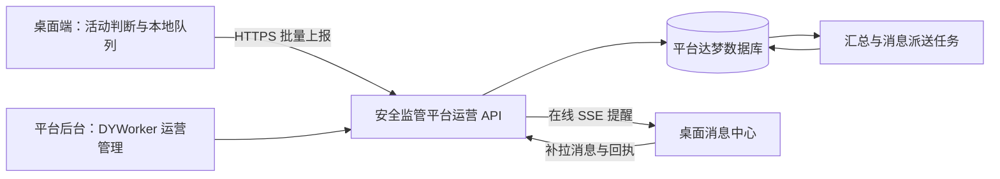

# DYWorker 使用统计与消息推送实施方案

初稿日期：2026-09-24；修订日期：2026-09-28。性质：技术设计，尚未实施。桌面代码初次核对基线：0.2.1；服务端归属按本次用户要求修订。

## 1. 目标与完成标准

在安全监管平台 `dyw_safetysupervisionplatform` 项目内建设“DYWorker 运营管理”，让管理员查看日活、月活、每日使用时长、联网 IP、版本分布，并向指定设备发送公告或更新提醒。DYWorker 项目只实现桌面采集、上报、消息接收和本地设置；服务接口、统计汇总、管理页面和数据库变更由安全监管平台项目承接。

交付完成必须同时满足：指标定义明确且能用样例核算；断网、重复上报、跨天、睡眠不会明显多算；消息能定向发送、补收、去重并查看回执；统计服务故障不影响本地工作；Windows、macOS、麒麟/UOS 目标安装包完成实测。

本文件的交付标准是：核实当前接入点，给出可执行的数据、接口、改造、部署与验收方案。以下时间、容量和效果指标是设计目标，不是已完成的实测结果。

## 2. 当前项目具备什么

| 现有能力 | 已检查的代码 | 本次如何使用 |
| --- | --- | --- |
| Electron 桌面端、React 界面，版本 0.2.1 | `package.json` | 保留桌面架构，增设运营服务 |
| 自动更新和当前版本读取 | `electron/app-updater.mjs`、`electron/main.mjs` | 复用版本来源和升级入口 |
| 本地模型用量统计 | `electron/main.mjs` 中 `usage:list`、`src/App.tsx` 中 `UsageStatsPanel` | 它统计模型 token，不能直接作为日活或使用时长 |
| 本地待处理收件箱、系统通知 | `electron/main.mjs` 中 `createInboxItem` | 复用展示经验，新增运营消息分类和独立存储 |
| 睡眠恢复、解锁监听 | `electron/main.mjs` 中 `startScheduler` | 为时长统计增加独立状态监听 |
| 本地设置、系统安全存储、受信界面通信 | `electron/settings.mjs`、`electron/preload.cjs`、`trustedHandle` | 保存统计设置，保护设备凭据 |
| QQ/微信工作渠道 | `electron/channels/` | 保持工作任务渠道用途，不充当运营群发渠道 |

初次检索在 DYWorker 桌面仓库内未发现统一应用账号体系、远端运营统计后台或运营推送服务。微信扫码登录是消息渠道登录，不等于应用用户身份。安全监管平台现有 IAM 和站内消息是服务端可复用基础，不代表桌面端已接入账号或设备推送。

当前 Windows/Linux 关闭全部窗口会退出进程；macOS 关闭窗口可能仍保留进程。不能把“窗口关了”和“应用退出了”当成同一状态。

README 有“所有数据都留在本机，不上传云端”的表述。上线统计前必须同步调整说明，准确区分本地业务资料、用户配置的模型请求和新增使用统计数据。

## 3. 推荐建设方式

服务端明确落在安全监管平台项目中，沿用现有 Python / Flask / SQLAlchemy 与达梦数据库；管理页面加入现有 `frontend`（Umi / React / Ant Design Pro），图表使用 ECharts。复用平台登录、权限校验与操作记录，不另建 TypeScript 服务、数据库系统或管理员账号体系。

本机路径核对：用户提供的 `../../../我的/dyw_safetysupervisionplatform/` 从当前桌面项目目录解析后不存在；本次实际只读核对的是 `/Users/gdy/Documents/我的/App/safety_production/dyw_safetysupervisionplatform` 同名项目。以下服务端相对路径均以该已找到的项目为参考；正式实施前须核对最终工作目录，本次没有修改该平台仓库。

| 已核对的平台能力 | 对应位置 | 复用边界 |
| --- | --- | --- |
| Flask / SQLAlchemy / 达梦 | `backend2/requirements.txt`、`backend2/app.py`、`backend2/core/extensions.py` | 新增运营模块，沿用数据访问与部署规范 |
| IAM 应用、接入端与授权接口 | `backend2/api/iam_api.py`、`iam_admin.py`、`iam_oauth.py` | 管理端复用登录；桌面账号绑定作为独立后续步骤 |
| 角色权限及操作记录 | `backend2/core/authz.py`、`core/operation_log_ctx.py` | 新增运营权限，并限制可管理的应用范围 |
| 站内消息与用户收件记录 | `backend2/api/notification.py`、`backend2/models/notification.py` | 现有收件人要求平台用户 ID；不能直接塞入匿名安装 ID |
| 消息管理页面及图表依赖 | `frontend/src/pages/system/notification/index.tsx`、`frontend/package.json` | 复用组件和交互规范，新增设备运营页面 |
| 版本 SQL 目录 | `backend2/db/update/` | 本次所有表、索引、权限和菜单变更集中到一个目标版本脚本 |

应用数据在逻辑上按 `app_id` 隔离，设备凭据绑定应用与安装；管理接口必须同时检查功能权限和应用范围。这里的 `app_id` 对应 IAM 中注册的应用，不能由桌面请求任意声明。普通匿名安装不因此获得安全监管业务数据访问权。

普通版本连接安全监管平台对外提供的受控运营接口地址；政府或内网版本支持配置对应内部部署地址，也支持完全关闭。统计上传和消息订阅分别开关，关闭统计不应强制关闭消息。

首期建议：统计默认关闭，说明字段和用途后由用户开启；设备注册在开启任一联网运营功能后发生。政府版默认不连接公网运营服务。这是产品设计建议，不是对法定义务的结论。

## 4. 统计口径

所有时间以 UTC 存储，业务报表按 `Asia/Shanghai` 切日。报表显示统计口径版本、更新时间、迟到数据提示以及“仅包含已开启统计且已成功上报的设备”。不能据此宣称覆盖全部安装量。

| 指标 | 首期定义 |
| --- | --- |
| 日活设备 DAU | 一天内至少发生一次合格人工交互，或至少有一段有效前台使用时间的去重安装数 |
| 月活设备 MAU | 自然月内活跃安装数去重；本月显示“截至当前” |
| 近 30 日活跃设备 | 当天及前 29 天的活跃安装数去重，单列，不能与自然月 MAU 混用 |
| 新增设备 | 首次启用统计并成功登记的安装数；标为“新增统计设备”，不称为下载量 |
| 每日使用时长 | 每台安装当天有效前台使用区间的并集秒数，页面以分钟显示 |
| 日均使用时长 | 当日有效前台总秒数 ÷ 当日 DAU；DAU 为 0 时显示“—” |
| 后台任务时长 | 本地或远程任务运行区间另算；并发任务区间合并后作为设备忙碌时长，不计入前台使用时长 |
| 近期在线设备 | 最近 5 分钟有经过设备身份验证的心跳，不等同于活跃设备 |
| 版本分布 | 选定期间内每台活跃安装最后一次有效活动对应的版本，每台只归一个版本 |
| 版本使用明细 | 各版本实际使用时间，可跨版本；每版本去重设备数不能相加当总设备数 |
| IP | 服务器收到请求时观察到的网络出口地址，附观察时间；不作为设备或用户身份 |

### 4.1 设备身份与未来账号

- `installation_id`：首次注册生成随机 UUID，保存在应用用户数据目录。表示一个应用安装配置，不是物理电脑指纹；同一电脑不同系统用户通常算不同安装。
- 普通升级保留标识；清除用户数据或重装后未保留数据会产生新标识。克隆用户目录可能重复，出现冲突只做诊断，不使用硬件指纹暗中合并。
- 不采集 MAC 地址、硬盘序列号、主机名、系统用户名。IP 变化不生成新设备标识，同 IP 多设备不合并。
- 首期只能可靠报告设备口径，不能声称是真实人数。后续若接应用登录，服务端从验证后的账号凭据取得 `user_id`，再单列账号日活/月活；不能由客户端任意填写账号或单位身份。
- 登录前后不自动倒推合并全部历史；同一账号多设备的人均时长按账号时间区间并集合并，设备时长仍分别保留。

### 4.2 活跃及使用时长算法

采用“前台有效使用时长”这个可解释的估计值，不声称测出人的注意力。

1. 只有业务窗口可见、未最小化、处于前台，且近期存在应用内人工交互时才计时。交互只记录发生时间，不读取键盘内容、剪贴板或页面正文。
2. 鼠标点击、键盘输入、滚动等实际交互续期；默认连续 120 秒无应用内人工交互即停止计时。单纯聚焦或自动启动不算日活；人工提交任务即使很快切走仍算当日日活。
3. 首次交互后允许最多 120 秒静态阅读时间；系统空闲状态可进一步缩短这个窗口。长时间静态阅读会低估，属于明确的口径取舍，可在试点后统一调整并升级口径版本。
4. 后台、锁屏、睡眠、退出立即结束区间。恢复时重新判断，不将中间间隔补记。每 5 秒检查状态，每 15 秒保存当前已确认的进度。
5. 使用单调时钟计算经过时间；若两次检查间隔超过 15 秒且没有连续状态证据，保守丢弃不确定间隔，防止休眠或卡顿多算。使用墙上时间只负责把已确认区间定位到报表日期。
6. 区间采用左闭右开 `[start, end)`，最长每 5 分钟封口一次；失焦、版本变化、跨日、统计关闭时立即封口。只合并连续且身份、版本、日期相同的区间，不把两个区间之间的空闲填上。
7. 同一安装多个窗口/进程只汇总一份区间并集；采集模块取得本地单写锁，避免为增加统计而改变现有多窗口工作行为。服务端仍对重叠区间求并集兜底。
8. 模型持续输出、定时任务、QQ/微信入站、应用内自动点击不延长人工活动窗口。内置浏览器只提供受控的“发生交互”信号，不上传网址或正文；电脑操控进行期间保守暂停人工计时，避免把自动输入算成人工。
9. Linux 锁屏状态需要额外接系统能力；若信号不可用，结合窗口状态和输入超时保守处理，并记录质量标志。在真实麒麟/UOS 验证前，不承诺与其他系统同等精度。

Electron 提供睡眠、恢复、系统空闲能力，但文档中的 `lock-screen` / `unlock-screen` 事件只标注 macOS、Windows；不能仅靠这两个事件覆盖 Linux。[Electron powerMonitor 文档](https://www.electronjs.org/docs/latest/api/power-monitor)

### 4.3 离线、异常与时间纠偏

- 开启统计后，区间先写本地队列，再上报。每 60 秒尝试发送已封口数据；当前长区间最多等待 5 分钟封口。指标正常约 6 分钟内更新，后台标记实时值为暂定。
- 首个合格交互立即生成轻量 `app_activity` 事件，避免短暂使用漏记日活；持续活动区间本身也可贡献跨日活跃。
- 每条记录有固定 `event_id`、运行 `run_id`、递增序号、`schema_version`、`metric_version`、版本和时间质量标志。重试保持原 ID，不生成新事件。
- 服务器事务保存成功后才确认；客户端收到逐条接受/重复确认才删记录。无效记录单独拒收，不能让一条坏数据阻塞整批。
- 断网指数退避加随机抖动；本地最多保存 7 天或 20 MB，先到者生效。超限丢弃最旧记录并显示覆盖缺口，不能把丢失数据补成 0。
- 退出时先本地保存，网络尝试最长 1 秒，不等待统计服务器才允许退出。进程被强杀时不推算到下次启动，目标最多损失最后 15 秒未保存进度；磁盘故障另列质量异常。
- 同时保存 `occurred_at` 和服务器 `received_at`。在线时估计时钟偏差，同一运行使用单调时间锚定；没有可信锚点或校准后仍异常的数据进入待审统计，不强行归到接收当天。
- 支持回补 7 天内数据；迟到事件触发受影响日期及月份重算。日报在次日生成但最近 7 天允许修订，月末同理保留修订窗口；更旧记录不静默污染已经稳定的报表。

## 5. IP 与版本怎么记录

IP 由运营服务入口读取连接来源；部署反向代理时只信任配置过的代理链，由入口覆盖外部伪造的转发头。统一规范化 IPv4、IPv6，不接受客户端声称的“公网 IP”。

建议保存最近联网 IP、最近联网时间和短期变化历史。默认后台遮罩展示，授权人员可查看完整 IP，查看和导出留操作记录。VPN、代理和单位共享出口会使地理位置及设备判断失真；地区查询只能作为可选粗略信息。

离线记录补传时，只能知道“补传时的 IP”，不能据此回填过去每次使用时的真实 IP。若需要当日 IP，展示当日实时联网观察记录；无记录显示未知。

版本从主进程 `app.getVersion()` 获取，同时记录 `platform`、`arch`、`release_channel` 和可选构建号。开发环境默认不上传正式报表，测试设备单独标记。

设备列表中的版本必须写“最近上报版本”，附最后活动时间；长期未联网不能断言当前还在使用该版本。版本占比以该期间活跃设备为分母，不混入所有历史安装。

更新通知复用原升级入口；是否升级成功以新版本首次成功上报为证据，不能把点击下载当升级成功。

## 6. 消息推送

首期支持公告、版本提醒、维护通知，按当前应用下全部订阅设备、指定安装、平台、版本范围、发布渠道筛选；只有未来通过平台 IAM 完成可信单位或账号绑定后，才开放按单位、账号筛选。发布、统计和导出均限定管理员可管理的应用范围。

### 6.1 发送与接收流程

1. 管理员建立草稿，填写标题、正文、类别、跳转、受众、计划时间、过期时间、提醒方式；先发到测试设备预览，再发布。
2. 在实际发送时间固定受众快照，以当时已订阅、未注销且符合条件的设备为准；明确显示使用的是设备最近上报属性。发送后新增安装不自动算作原批次受众。
3. 消息、受众和待派送任务在同一数据库事务内保存；发布请求有幂等键，避免超时重试形成重复群发。
4. 在线设备通过 SSE 收到“有新消息”的提示，再通过带鉴权的接口拉取消息；SSE 只是加速手段，数据库消息记录是补收依据。
5. 每 5 分钟轮询兜底，启动、恢复联网后立即补拉。SSE 重连带持久化游标，游标过期返回重新同步标志；心跳注释维持连接，反向代理关闭该接口的响应缓冲。
6. 桌面主进程用支持请求头的流式客户端建立连接并实现解析、游标和退避，凭据放 Authorization 请求头，不放 URL，也不假定浏览器原生 EventSource 支持自定义鉴权头。
7. 消息保存到本地消息中心后回报“已接收”，根据用户设置尝试显示系统通知。只有用户实际打开对应消息才记“已读”。
8. 以 `(message_id, installation_id)` 去重；游标推进与本地消息保存一并持久化。回执可重传且不会倒退已读状态。系统弹窗跨崩溃很难严格保证恰好一次，优先防止重复打扰，消息中心保证可查。

SSE 是服务端到客户端的单向事件流，事件 ID 和重连字段适合在线提醒；确认、已读等通过普通 HTTPS 请求回传。[MDN SSE 文档](https://developer.mozilla.org/en-US/docs/Web/API/Server-sent_events/Using_server-sent_events)

### 6.2 能力边界与状态

| 应用状态 | 首期行为 |
| --- | --- |
| 应用正在运行且联网 | 在线提醒，消息进入消息中心，可显示系统通知 |
| 运行中但断网/睡眠 | 恢复后补拉未过期消息 |
| 关闭窗口但进程仍运行 | 可以保持订阅；不因此计入活跃或前台时长 |
| 应用已完全退出 | 不承诺即时提醒；下次打开后补收 |
| 系统通知被关闭或不支持 | 消息中心仍可见，不声称系统通知已经展示 |
| 消息已过期或撤回 | 未投递的不再投递；已收到的同步标记撤回，无法保证收回用户已经看到的内容 |

若要求“完全退出后仍能即时收到”，需要单独立项评估系统推送或常驻辅助程序及其各平台限制，不能靠一条 SSE 连接承诺实现。首期不自动增加开机常驻。

统计分别展示：目标设备数、待接收、已接收、已读、已点击、已过期、失败。已接收是客户端已落盘，不代表系统通知展示或用户看见。通知展示能力取决于平台和安装配置，需以真实安装包验收。[Electron 通知文档](https://www.electronjs.org/docs/latest/tutorial/notifications)

送达率 = 已接收设备数 / 目标快照设备数；阅读率 = 已读设备数 / 已接收设备数；分母为 0 显示“—”。撤回和退订数量单列，不偷偷改变原批次分母。

运营消息使用独立类型/数据文件，不能调用会创建任务审批承诺的 `createInboxItem`；现有退出逻辑会终止待处理审批，不能让它清掉运营公告。界面可以共享收件箱入口，以“任务待办 / 系统消息”切换。

正文只允许纯文本或经过清理的有限 Markdown；跳转仅允许白名单 HTTPS 地址或固定应用页面。消息不能携带可执行命令、自动批准任务或替换更新源。支持用户关闭营销类提醒、免打扰时段及普通消息每日弹窗上限，所有消息仍可在中心查看。

## 7. 数据与接口设计

### 7.1 主要表

下表是逻辑名称。平台物理表建议使用 `DAYAWAN.DYW_*`，沿用项目大写列名、主键和日期类型约定；应用级表含 `APP_ID`，所有设备查询均从已验证凭据确定所属应用。最终物理名称在统一版本 SQL 中确定。

运营消息采用独立的设备消息表及设备收件表，复用平台消息管理的界面和权限机制，不直接修改 `SYS_NOTIFICATION_RECIPIENT.USER_ID` 的含义。平台既有用户站内信继续使用原表；如后续实现一次发布到两类收件人，应记录关联批次并分别统计回执，避免用户已读与设备已接收混算。

| 表 | 主要内容与约束 |
| --- | --- |
| `app_installations` | 安装 ID、首次/最近联网、版本/平台/渠道、订阅状态、凭据摘要、撤销状态；将消息登记与统计启用时间分开 |
| `telemetry_consents` | 安装 ID、设置版本、启停时间、统计授权代次；阻止关闭后旧队列重新提交 |
| `app_events` | 原始活动/区间/可选任务事件，事件 ID、时间、版本、质量标志；`installation_id + event_id` 唯一 |
| `installation_ip_observations` | 安装 ID、联网时间、服务端观察 IP；单独短期保留 |
| `installation_daily_usage` | 日期、安装 ID、口径版本、活动标记、并集时长、当日最后版本、质量状态 |
| `installation_daily_version_usage` | 日期、安装 ID、版本、时长，支持同一天升级前后拆分 |
| `app_daily_metrics` | 日期、维度、口径版本、DAU、时长、更新时间；作为缓存，可重建 |
| `messages` | 消息正文、受众条件快照、计划/过期时间、草稿/发布/撤回状态、发布幂等键 |
| `message_recipients` | 消息 ID、安装 ID、接收/阅读/点击时间、派送状态；二者联合唯一 |
| `delivery_outbox` | 待派送任务、重试次数、下次时间；与发布事务一起提交 |
| 管理操作记录（复用平台现有机制） | 发布、撤回、完整 IP 查看、导出、设置变更等操作，补充应用及消息/设备关联标识 |

首期 `app_events` 使用普通表和全局唯一约束；不要贸然按日期分区后丢失跨分区幂等性。确有分区需求时单独设计去重键登记表及与原始数据一致的保留期。

事件唯一键由达梦唯一约束兜底。通过 SQLAlchemy 插入，重复时仅识别对应事件唯一约束冲突，回滚该条保存点或独立事务后重新查询并返回“重复已接收”；其他数据库错误不得当成重复成功。不能只用“先查后插”应对并发，也不能直接采用其他数据库专属的冲突插入语法。批量部分成功、事务回滚、唯一约束识别须在实际达梦版本和驱动上验证。汇总由有效事件重算或用事务内唯一处理记录保证幂等，不简单收到一次就加一次时长。

MAU 从每日安装明细做期间去重，不能将每天 DAU 相加；按不同平台/版本/渠道维度筛选后重新去重，不直接相加已经汇总的分组数量。

**数据库变更统一维护在安全监管平台 `backend2/db/update/v_<目标平台版本>_script.sql` 这一个目标版本文件中，包含表、索引、权限、菜单及升级说明；不在桌面仓库新建 SQL，也不拆成零散脚本。复用实施时已确定的目标平台版本文件，若尚未创建则只创建这一个版本文件，不修改已发布历史脚本。本次已看到 `v_2_1_0_script.sql`，但它用于既有 IAM 功能，不能据此直接认定是本次目标版本。**

### 7.2 最小接口清单

接口统一挂载在平台 `/api/v1/dyworker` 下，避免与现有 `/notifications`、`/iam` 等接口混淆。以下均是拟新增接口，尚不存在；响应沿用平台 `code / message / data` 包装，并对鉴权失败和重试条件给出明确 HTTP 状态。

| 接口 | 用途 |
| --- | --- |
| `POST /api/v1/dyworker/installations/register` | 登记安装，返回限权设备凭据及服务器时间 |
| `POST /api/v1/dyworker/installations/credentials/rotate` | 验证旧凭据后轮换；撤销设备禁止恢复上报 |
| `PUT /api/v1/dyworker/installations/preferences` | 更新统计和消息设置，推进授权代次 |
| `POST /api/v1/dyworker/telemetry/batches` | 批量上传，返回每条接受/重复/拒绝结果 |
| `POST /api/v1/dyworker/installations/heartbeat` | 上报在线状态与当前版本，默认 60 秒并加抖动 |
| `GET /api/v1/dyworker/messages/stream` | 带鉴权 SSE，提示有新消息 |
| `GET /api/v1/dyworker/messages?cursor=…` | 分页补拉消息和撤回标记 |
| `POST /api/v1/dyworker/messages/receipts` | 接收、已读、点击回执，限定当前设备 |
| `GET /api/v1/dyworker/admin/metrics` | 查询日/月统计，返回口径、时间范围、完整性标记 |
| `GET /api/v1/dyworker/admin/installations` | 分页查询版本、平台、最近联网及授权可见的 IP |
| `POST /api/v1/dyworker/admin/messages` | 创建草稿 |
| `POST /api/v1/dyworker/admin/messages/{id}/publish` | 预览受众后发布或预约，必带幂等键 |
| `POST /api/v1/dyworker/admin/messages/{id}/revoke` | 撤回，保留操作记录 |
| `DELETE /api/v1/dyworker/installations/me` | 撤销凭据并启动该安装相关数据删除流程 |

设备凭据只能操作自己的事件和消息，不能读取运营报表。公开桌面包中的固定密钥不能被当作可信身份；开放注册只能降低伪造成本，不能证明是真实自然人。采用注册/设备/IP 多级限流、配额和异常时长检查；企业版可使用管理员发放的一次性注册凭证。不要仅因多人共享出口就整网封禁。

设备密钥使用现有安全存储；安全存储不可用时不明文落盘，可改为仅会话内保存并提示联网功能受限。管理后台使用平台现有登录态和权限机制。新增权限建议为 `system.dyworker.metrics.view`、`system.dyworker.device.view`、`system.dyworker.ip.view`、`system.dyworker.message.publish`、`system.dyworker.data.export` 等平台管理权限，最终按平台权限归属规范登记。查看统计不自动获得完整 IP 或发布权限，前端隐藏按钮不能替代服务端校验。

设备接口使用独立的限权设备凭据校验器，不能要求匿名设备伪装成平台登录用户，也不能为方便接入而放宽现有用户接口。后续绑定账号时复用平台已实现的 IAM 授权流程，服务端验证凭据主体、应用范围及有效性；设备统计凭据不能作为访问安全监管业务的用户凭据。

## 8. 项目改造位置

下表前 8 项为 DYWorker 桌面项目；其余带“平台”字样的项在安全监管平台项目实现。所有新增路径只是拟定落点，当前没有创建业务文件。

| 位置（新增项为建议路径） | 改造职责 |
| --- | --- |
| 新增 `electron/telemetry.mjs` | 活动状态机、区间计算、设备注册、批量上传 |
| 新增 `electron/telemetry-store.mjs` | 原子写入队列、确认删除、容量限制、运行锁 |
| 新增 `electron/remote-messages.mjs` | 订阅、拉取、去重、回执、系统提醒 |
| `electron/main.mjs` | 接入启动/退出/窗口/电源事件，复用主进程版本值和受信通信 |
| `electron/preload.cjs`、`src/types.ts` | 最小设置、人工活动、消息查询与已读接口；不暴露凭据 |
| `electron/settings.mjs` | 统计开关、消息订阅、免打扰、受控服务地址 |
| 新增 `src/SystemMessagesPanel.tsx` | 消息列表、未读、详情、固定跳转 |
| `src/App.tsx` | 设置入口、消息入口与人工活动信号，不塞入全部统计逻辑 |
| 平台新增 `backend2/api/dyworker.py`、`dyworker_admin.py` | 设备和管理接口分开鉴权，在 `backend2/app.py` 注册 |
| 平台新增 `backend2/models/dyworker.py` | 设备、事件、每日汇总、消息与回执模型，并加入模型注册 |
| 平台新增 `backend2/services/dyworker/` | 汇总、补偿、清理与消息派送；由单独作业入口运行 |
| 平台新增 `frontend/src/pages/system/dyworker/` | 统计、设备、消息发布与回执页面，复用项目公共表格/权限组件 |
| 平台新增 `frontend/src/services/dyworker.ts` | 管理接口类型和请求封装 |
| 平台修改 `frontend/config/routes.ts` 及权限登记 | 运营菜单、页面访问权限和操作权限 |
| 平台 `backend2/db/update/v_<目标平台版本>_script.sql` | 本次全部数据库及权限菜单变更统一维护 |
| 平台新增 `backend2/tests/test_dyworker_*.py` | 接收去重、统计、设备鉴权、应用隔离及消息生命周期验证 |

后台首页建议展示日活趋势、自然月月活、每日总时长与平均时长、版本占比、最近在线设备、通知接收/阅读情况。明细支持日期、平台、版本、渠道筛选及权限控制的导出。

## 9. 数据范围、保留与停用

只上传本方案列明的使用元数据，不上传聊天内容、文件名/路径、文件正文、提示词、模型地址、API 密钥、浏览记录。事件属性采用字段白名单和长度上限，不允许任意对象透传；错误只上传分类码，不上传可能带正文的完整错误堆栈。

建议初始保留策略：本地待上传队列 7 天/20 MB；服务器活动明细 30 天；安装每日去重明细及汇总 13 个月；完整 IP 7 天；消息与回执 90 天；管理员审计 180 天。均为待业务确定的配置，不是法规期限。代理访问日志、备份及监控也要执行对应脱敏和清理策略。

保留每日去重明细是为了计算跨天月活；仅保留每天的总人数无法重新算 MAU。安装日明细仍可关联设备，不称为匿名汇总。

关闭统计：立即停止采集、取消待发送、清除本地统计队列，并同步服务端授权代次；关闭后的旧批次被拒绝。断网关闭也先本地生效，重连先同步关闭设置再进行任何上传；已在途且在关闭生效前接收的数据走删除流程处理。

消息订阅可独立保留，因此服务器仍会观察消息请求的 IP，并保存必要版本、在线时间和订阅记录；这些不自动贡献 DAU。两项都关闭时停止运营注册、心跳和连接，原有模型/更新功能按自己的设置继续工作。

提供“删除此安装已上传数据”入口：删除安装关联明细、回执和观察记录，重算受影响汇总，撤销凭据；对备份保留删除标记并在恢复后重放删除。试点先验证删除流程后再扩大采集。

## 10. 部署、容量与运维

部署归属安全监管平台：复用现有 TLS 入口、Flask 应用、达梦与前端发布流程；按需增加同项目下的独立汇总/派送作业进程。开发、测试、正式环境隔离，扩展现有备份策略并验证恢复。运营服务不可用时桌面继续本地工作。

平台现有 `backend2/gunicorn.conf.py` 使用多 worker、每 worker 默认 4 线程并开启预加载；不能把大量 SSE 长连接直接塞入现有业务请求池。实时推送在同一平台项目内用单独的连接服务进程/路由承接，并限制连接数，不在长连接期间持有数据库连接或事务。实现与压测通过前先启用每 5 分钟补拉，后台明确标为轮询模式；此时不宣称达到 10 秒实时目标。

汇总、定时发布与清理作业不能在每个 Flask worker 初始化时各启动一份。使用独立作业入口，以及数据库租约/原子状态更新防止重复领取；重启后通过待派送表恢复。对达梦的领取锁、事务隔离与竞争重试进行真实数据库测试，不假定其他数据库的锁语法可以直接使用。

平台整体需要接收匿名设备上报时，只开放限权的设备注册、上报和消息入口，不额外暴露安全监管管理接口。现有访问日志、错误日志和操作日志采集需检查是否会记录事件正文或 Authorization，并在接入时限制字段与日志量。

容量举例仅供预算：假设日活 10,000 台、每天前台使用 2 小时、每 5 分钟一个连续区间，则为 `10,000 × 2 × 60 / 5 = 240,000` 个区间/日。按每条编码后 600 字节估算，原始传输约 144 MB/日、30 天约 4.32 GB；实际数据库还包含索引、事务日志、重复请求及区间碎片，不能按此直接采购磁盘。

若每台每天联网 8 小时、每 60 秒心跳，则另有 480 万次心跳/日，平均约 56 次/秒，且有明显高峰。心跳只更新最近状态，不把每次心跳存成活动事件；IP 变化/按观察时间桶采样落盘，避免形成无意义明细。大量重复状态写入可在压测后增加缓存合并。

复用平台不等于现有服务器一定有足够余量。先测现有业务基线，再叠加采集写入、同时在线 SSE、整点重连、群发积压、区间碎片和月活查询；根据达梦连接池、写入延迟和业务接口延迟决定配额或扩容。运营连接、作业并发与资源额度应隔离，不能让统计和群发拖慢检查整改等原有业务；多实例提醒以数据库待派送记录及补拉兜底。

监控：接收延迟、失败率、重复率、非法事件、客户端队列丢弃、汇总积压、SSE 在线连接、消息接收延迟、存储增长。升级采用先服务端兼容旧事件，再发布小范围客户端；后台远程停用只能关闭采集，不能越过用户开关开启。回退客户端时保留队列格式兼容或安全丢弃并标记缺口。

## 11. 实施阶段与工作量

以下为一名熟悉两个项目的开发人员的工作日粗估；复用平台会减少后台基础建设，但增加达梦兼容、权限隔离及原业务回归工作。尚无压测和环境接入结果，不能视为承诺。按 5 日工作周仍暂估 4–6 周；桌面账号绑定、退出后推送另计，不新建账号体系。

| 阶段 | 交付 | 估计 |
| --- | --- | --- |
| 1. 口径与平台接入 | 字段协议、开关、设备登记、身份/权限接入、统一 SQL 与平台路由 | 3–4 天 |
| 2. 采集和统计 | 前台时长、离线补传、去重、IP/版本、日/月报与后台 | 6–8 天 |
| 3. 消息中心 | 草稿/定向/预约、SSE/补拉、系统通知、回执、撤回 | 5–7 天 |
| 4. 验收与试点 | 三类系统安装包、达梦、权限/删除、平台回归、压测和小范围发布 | 4–6 天 |

首期范围到此为止。留存、功能使用率、崩溃率、升级转化、真实账号日活可以随后增加，但需要各自补充定义及最少字段，不能首期顺手采集所有业务内容。

## 12. 验收用例与通过标准

| 场景 | 预期 |
| --- | --- |
| 同一安装一天启动 5 次并操作 | DAU = 1；不按启动次数累加 |
| A 连续两天活跃，B 仅第二天活跃 | 两天 DAU 分别为 1、2；当月 MAU = 2 |
| 后台自启、定时任务或远程渠道任务运行，无人工操作 | 前台日活与前台时长不增加，后台任务指标可增加 |
| 前台交互持续 10 分钟，切走 20 分钟，回来交互 5 分钟 | 前台时长约 15 分钟；正常状态检测边界误差每次目标不超过 5 秒 |
| 最后一次输入后一直不操作 | 最多计入默认 120 秒阅读宽限，后续停止 |
| 持续操作 23:58–次日 00:03 | 两天分别计 2 分钟、3 分钟；两天均活跃，月活期间去重 |
| 电脑睡眠 8 小时、系统改时、应用卡顿 | 不把无证据的间隔加到使用时间，异常数据有标记 |
| 同一安装窗口使用区间重叠 | 总时长按并集，不翻倍 |
| 同一事件上传 10 次，或入库后断连再重试 | 事件和时长均只计一次 |
| 断网两天后恢复 | 在原活动日期补回，刷新相应日报/月报；IP 标为恢复上传时观察值 |
| 使用中强杀进程 | 不补算到下次启动；无磁盘故障时未保存损失目标 ≤15 秒 |
| 一天从旧版升级到新版并继续使用 | 版本分布只计最后使用的新版，时长明细仍按两个版本拆分 |
| 1 个 IP 下 100 台安装，或 1 台安装切换网络 | 前者按 100 台分别识别，后者仍为 1 台 |
| 发布超时后重复点击/重试，消息连接反复重连 | 只有一个发布批次和一份本地消息，回执不重复累计 |
| 向旧版 Windows 设备发送，其他平台/新版不匹配 | 仅快照目标收到；依据是最近已知版本，界面明确说明 |
| 应用退出期间发布消息，下次启动 | 补收未过期消息，过期/撤回内容不弹窗 |
| 用户拒绝系统通知或 Linux 不支持通知 | 消息中心仍可阅读，状态不虚报为系统展示 |
| 统计关闭但消息开启 | 不上传活动和时长，仍可接消息；必要连接数据说明清楚 |
| 关闭统计、删除数据、服务端撤销凭据 | 停止采集并清队列，旧批次被拒绝，删除/汇总修正可核验 |
| 伪造设备 ID/转发 IP、普通设备访问管理接口 | 不越权，不信任外部自报的来源 IP |
| 运营服务中断或慢响应 | 打开应用、执行任务、退出均不被运营功能阻塞 |
| 设备凭据访问管理后台、普通账号跨应用查询或发布 | 服务端拒绝；匿名设备不能读取平台业务数据 |
| 达梦并发重复插入、部分失败、批量回滚及补传 | 正确区分重复与失败，时长和回执不重复；原有数据不受影响 |
| Flask 多 worker、作业重启、租约到期 | 不重复汇总/发布，未完成工作可以恢复 |
| 运营群发和上报压测同时运行原平台核心接口 | 检查整改、原站内消息和 IAM 流程仍正常；性能满足事前约定的业务基线 |
| 只启用轮询，未启用独立实时连接服务 | 展示轮询模式，按 5 分钟目标验收，不冒称 10 秒实时送达 |

上线门槛：以上确定性用例全部通过；在目标负载下正常消息接收延迟 P95 目标 ≤10 秒（轮询降级 ≤5 分钟，不含离线及系统通知显示时间），统计延迟 P95 目标 ≤6 分钟；完成各目标系统安装包实测及至少一轮小范围试点。未测平台明确列为未验收，不以网页预览或构建通过代替。

## 13. 本次方案核验情况

初稿已核对桌面版本、自动更新、模型用量、本地收件箱、通知、设置、进程退出行为及相关官方文档，并独立核算去重、区间并集、跨日及容量示例。

本次修订已只读核对所找到的安全监管平台项目中的 Flask / 达梦依赖、IAM 路由与权限、用户站内消息模型、管理页面、版本 SQL 目录及 Gunicorn 配置。已将原先另建服务、管理后台和数据库的安排替换为平台内模块，并检查接口前缀、两边改造清单、权限与消息边界的一致性。

本次仅修订 DYWorker 项目中的这份方案，没有修改平台代码、执行 SQL、连接生产数据库、部署或重启服务。文档核查不能替代实际达梦、跨项目联调及各系统安装包验收。
