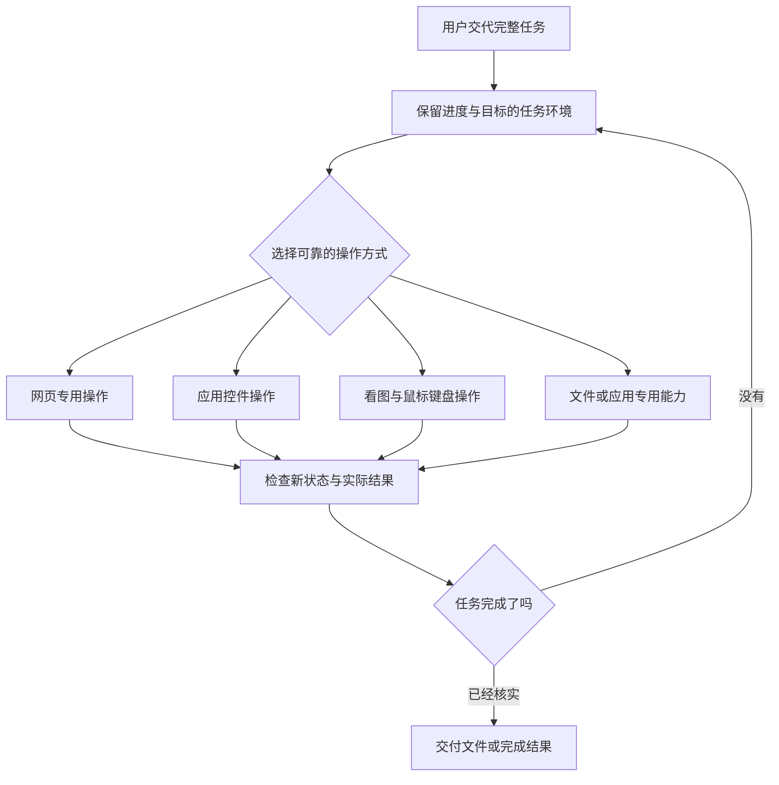

# 麒麟 Computer Use 优化方案

核对日期：2026-09-08。对象：当前 DYWorker 公共项目。本文是待实施的方案，不表示相关功能已经交付。

## 结论和完成标准

推荐在现有 Linux 操作模块上，建设“统一任务环境 + 浏览器专用操作 + 原生应用控件操作 + 看图操作兜底 + 结果验证”。目标是让用户交代完整任务后，系统持续执行、处理常见变化、验证交付物。

“像最新版 Codex 一样强”分成两个目标：功能覆盖可以逐项建设；实际任务完成率必须在相同任务集上比较，不能用工具数量、接入同一模型或单次演示替代。

本次方案的完成标准：核对官方能力边界；检查现有实现；给出明确差距、实施顺序和交付条件；运行已有相关检查；明确实机待验证项。功能改造的完成标准在后面的验收章节定义。

暂以麒麟桌面版、ARM64、可用 X11 作为首轮适配假设，这是工作假设，不是已确认的用户设备信息。具体麒麟版本、处理器、桌面会话、WPS/浏览器版本和模型联网限制仍待确认。其他架构、Wayland 和完全离线场景分别验证，不混成一个“支持 Linux”的承诺。

## 对标依据

OpenAI 当前桌面 Computer Use 文档说明支持 macOS、Windows，覆盖跨应用工作，并有浏览器和办公软件专用集成；页面没有承诺麒麟支持。macOS 的后台使用与 Windows 的前台接管也有区别。不能把其中一个平台的效果直接当成麒麟可以复用的实现。[官方桌面说明](https://learn.chatgpt.com/docs/computer-use)

官方 API 指南给出的方案包括：在持续保留的环境中运行操作代码，或执行模型返回的鼠标键盘动作；也可以保留自有工具。具体执行环境和执行结果由应用提供。由此建议保留 DYWorker 现有工具入口，逐步升级内部能力，无需为工具命名重写整套产品。[官方接入指南](https://developers.openai.com/api/docs/guides/tools-computer-use)

以下架构是针对 DYWorker 和麒麟的设计建议，不代表对 Codex 未公开内部实现的描述。

## 当前项目的实际基础与差距

| 方面 | 当前实现 | 应补齐的内容 |
| --- | --- | --- |
| 桌面基本操作 | 已有应用发现、启动、目标窗口截图、点击、拖动、按键、中文输入 | 坐标滚动、悬停、复杂弹窗、多屏缩放和状态检查 |
| 控件识别 | Python 通过 AT-SPI 遍历目标窗口，输出 e0 等序号 | 持续会话、可靠的控件身份、过期引用检测、事件变化监听 |
| 窗口选择 | 已要求明确窗口，检查应用和窗口标题，并限制坐标范围 | 弹窗归属、标题正常变化、窗口重建、焦点被其他程序抢走后的恢复 |
| 结果检查 | 多数动作执行后返回“完成，请重新读取状态” | 自动返回操作后的新状态；区分“动作发出”“界面变化”“业务完成” |
| 看图能力 | 可把桌面截图送入支持图片的模型；部分文字模型先获取图片描述 | 电脑操作优先直接看图，保留位置关系；对不支持图片的模型明确能力限制 |
| 浏览器 | 内置单页面操作，正文读取、基础元素列表、点击、填写、保存截图 | 标签页、嵌套页面、上传、下载完成检测、弹窗、复杂控件、按名称定位和自动等待 |
| 独立工作环境 | 已有 Xvfb 启停和显示编号选择 | 窗口管理器、独立会话总线、应用进程归属、预览、接管、退出清理和启动失败处理 |
| 操作顺序与停止 | 桌面服务已有串行调用和取消子进程处理 | 多任务共享桌面的独占控制、跨浏览器/原生应用的协调、停止时释放按键及鼠标 |

检查中有四个值得优先处理的具体问题：

1. `element_at` 在每次操作时重新遍历控件树并按序号取元素。窗口绑定可以防选错文档，但不能保证控件树变化后 e12 还是原来的按钮。这是静态检查发现的误操作风险，尚未做麒麟实机复现。
2. Linux 的 `scroll` 要求控件编号，没有有效控件树时，看得到截图也缺少坐标滚动的工具入口。
3. 当前浏览器快照只输出前 60 个可交互元素，主要扫描主文档；截图工具只报告保存路径，没有在该工具结果中直接返回图片。复杂政务表单会很快触及这些限制。
4. Xvfb 当前启动逻辑只短暂检查套接字，并未完整验证桌面可用性；依赖缺失或启动失败存在回到用户当前显示环境的路径。正式的独立工作模式必须在失败时明确停止，避免不知情地切回真实桌面。

## 推荐设计

### 1. 一个任务环境，按情况选择操作方式

网页优先用可靠的网页操作能力；原生应用优先用控件动作；控件缺失、图表和画布用视觉操作。处理文档内容时可用成熟的文件能力提高效率，但用户明确要求操作当前打开的应用或保留未保存编辑时，应尊重这一范围。文件处理后仍要用目标软件检查最终显示效果。

统一观察结果应包含 sessionId、appId、windowId、frameId、observationId、时间、窗口位置、截图尺寸及缩放、控件属性和可用动作。模型不需要反复学习各软件不同的底层调用方式。

### 2. 保留任务状态，支持短段连续操作

保留应用、窗口、页面、已经确认的控件以及任务进度。一次可执行“定位输入框—填入内容—读回确认”这样的短操作段，减少每次点击都等待一轮模型的耗时。

执行器应提供等待条件、超时、停止信号、结果断言和观察点。先以有类型的有限动作组合实现；如开放持续脚本执行，应运行在受限进程或隔离环境中，并通过统一授权代理访问桌面。不能把 Node vm 或脚本黑名单当作安全边界，也不能让脚本直接绕过当前文件和应用授权。

动作段内遇到页面跳转、弹窗、目标消失或外部提交时立即检查新状态。每个独立桌面同一时刻只允许一个任务发送输入；服务内部已有的串行调用应保留，不能为追求速度把同一桌面的点击并行化。

### 3. 修复识别、等待和验证

- 将遍历序号改成与观察记录绑定的引用，操作前核对进程、窗口、角色、名称和必要状态。发现变化就重新观察，不继续解释旧编号。
- Python 助手升级为常驻会话，订阅相关事件，减少重复进程启动和整棵树扫描；不能仅靠缓存跳过动作前检查。
- 截图与控件树尽量在同一稳定窗口状态下获取；读取前后核对窗口位置和状态，变化则重取，防止两份资料对应不同画面。
- 动作前确认目标可见、可用、未被弹窗遮挡。控件优先执行自身动作；必须点坐标时，临近发出输入再核对窗口位置、焦点和边界。
- 增加坐标滚动、悬停、可配置拖动路径；对截图缩放、多屏负坐标和窗口移动使用明确的坐标转换。
- 输入中文后读回核对；保护剪贴板内容，避免在用户已更新剪贴板后强行恢复旧内容。拖动、组合键被中断时释放按键和鼠标。
- 返回 `executed`、`observed`、`verified` 等不同阶段的结果；发出 Ctrl+S 不代表保存已成功。
- 对常见失败先重新观察、尝试另一种定位方式，限定恢复次数。提交结果不明确时先查询是否已经提交，不能盲目重试。

### 4. 优先增强浏览器

首选验证 Playwright 与当前内置浏览器的接入可行性，必要时使用专用 Chromium 会话；接管用户已有浏览器另行通过用户授权的浏览器扩展建设。不可假设所有国产浏览器都支持同一连接方式。

按名称、角色、标签定位，补齐 iframe、开放的 Shadow DOM、下拉框、文件上传、下载、对话框和标签页管理。封闭控件或画布保留视觉兜底。Playwright 提供动作前可见、稳定、可接收事件等检查，可减少当前直接点击方式的不确定性。[自动等待](https://playwright.dev/docs/actionability)、[定位能力](https://playwright.dev/docs/locators)

连接方式、浏览器版本以及打包依赖必须先在麒麟目标架构试跑；官方能力说明不等于当前 Electron、国产浏览器和系统版本已经兼容。

政务网站还存在一个产品层面的阻碍：当前内置浏览器主动拒绝内网地址。应新增明确的受信任政务站点配置，在导航、跳转、新窗口、下载和实际请求边界一致执行；不能直接关闭现有检查或允许任意内网。

### 5. 两种桌面工作模式

| 模式 | 适用场景 | 必须说明和验证的行为 |
| --- | --- | --- |
| 当前桌面协作 | 操作用户已经打开、已经登录或尚未保存的应用 | 用户与助手交替使用；显示操作状态，随时暂停；不能承诺看图点击时完全不抢焦点 |
| 独立桌面工作 | 新建文件、整理资料、重复办公任务 | 应用运行在单独的图形会话中，用户可预览、暂停、接管；登录和文件交接有明确流程 |

X11 独立环境可从 Xvfb + 窗口管理器 + 独立 D-Bus/AT-SPI 会话做验证，配套受控应用启动器。后续再评估 Xpra 或远程画面预览方案。Xvfb 自身只提供显示环境，不能当作文件、进程、网络的安全隔离；若需要强隔离，使用独立系统用户或虚拟机，并配置文件共享范围。

注意 WPS 等单实例应用可能把新请求交给原来的进程。必须检查目标进程与桌面归属，必要时使用独立用户配置；独立桌面不是把用户已打开的窗口直接搬过去。独立环境启动失败应保持失败状态，不能回退到用户桌面继续执行。

Wayland 单独建设：按实际能力检测 ScreenCast、RemoteDesktop、PipeWire 和 libei/EIS，选择系统已支持的路径；授权和恢复能力取决于安装的 portal 及桌面后端。RemoteDesktop 官方接口提供会话、输入设备选择和 EIS 连接，但这不能证明每个麒麟版本已经提供这些能力。[RemoteDesktop 文档](https://flatpak.github.io/xdg-desktop-portal/docs/doc-org.freedesktop.portal.RemoteDesktop.html)

不建议默认依赖 root、全局输入设备放权或关闭桌面保护来完成兼容。若目标 Wayland 缺必要能力，明确提供经验证的 X11 独立环境或虚拟机路径，并测试目标办公软件能否在其中运行。

### 6. 模型选型按实际任务比较

首选能直接理解界面截图、准确定位目标、持续使用工具并检查结果的模型。当前部分模型走“图片变描述再交给文字模型”的路径，可保留为低要求场景的兼容方式，但不适合作为追求顶级电脑操作能力的主路线：描述可能丢掉位置和细节，还增加一次调用。

允许联网时，先用一个能力足够强的视觉模型建立基准，再比较国产模型。必须国产或离线时，保持同一执行器、同一任务集、同一输出检查方式比较，不能用“接口兼容”推断任务能力相同。离线方案的硬件需求取决于候选模型、量化、截图尺寸和响应目标，实测前不承诺普通办公机能够达到相同速度。

## 实施顺序和阶段交付

| 阶段 | | 必须交付的结果 |
| --- | --- | --- |
| 0：确定基线 |  | 环境检测报告；固定系统、WPS、浏览器和模型版本；选定办公任务并保存现有表现 |
| 1：修可靠性 | 过期引用保护、坐标滚动、动作前后检查、中文读回、停止释放输入；当前桌面可以稳定跑首批任务 |
| 2：浏览器和连续任务 | 标签页/上传/下载/复杂表单、受信任内网站点、持续任务状态和有限失败恢复 |
| 3：独立桌面 | 完整会话、预览与接管、进程归属、登录与文件交接、启动失败不回退 |
| 4：应用与发布验收 |  | WPS/文件管理器/目标业务系统实测；模型对比；麒麟安装包全流程复测 |

Wayland 先在阶段 0 完成能力探测，再决定主路径；缺失桌面后端支持时不能套用上述工期。

推荐第一批范围：一个明确版本的麒麟、一个处理器架构、WPS 文字/表格、文件管理器、一个实际使用的浏览器及两套代表性业务系统。第一批通过后再扩充应用清单。

## 如何验收“足够强”

建立 30 个任务，每个重复 5 次，每个候选模型和运行模式共 150 次。覆盖网页、WPS、文件管理、跨应用及异常恢复；用独立结果检查器或人工核验最终文件/页面，不能只接受模型说“完成”。

建议首轮门槛如下，均是目标值，不是当前成绩：

- 完整任务成功率至少 90%，并按任务类别分别报告，避免简单网页任务掩盖桌面失败。
- 普通任务在启动和既有授权完成后，因定位失败等原因额外要求用户介入的比例不超过 10%；明确要求人工完成的登录、验证码等步骤单独统计。
- 验收集中误操作其他窗口、停止后继续输入、重复提交、覆盖错误文件均为 0 次；这表示本轮未发生，不表示永久零风险。
- 记录每次完成耗时、模型调用量、成本、中途恢复次数和失败原因，同时给出中位数和较慢的一组结果。
- 与当前版本在同机同软件同任务上比较；与 Codex 比较时，网页可尽量保持相同环境，跨操作系统的办公软件差异必须单独标注。
- 如果要宣称“接近 Codex”，建议同时满足：可比任务成功率差距不超过 5 个百分点，耗时和人工介入处于事先约定范围。150 次仅能作为试点结果，接近边界时扩样确认，不能据此泛化为所有应用能力相同。

代表性任务：

| 任务 | 最终检查方式 |
| --- | --- |
| 业务网页筛选记录并导出表格 | 核对筛选条件、导出行数、关键字段和实际文件 |
| WPS 打开指定文档、改标题、另存、导出 PDF | 核对原文件保留、输出路径、正文和显示效果 |
| WPS 表格填入中文与数字、计算合计 | 读回单元格、核对公式和结果，重新打开确认 |
| 浏览器下载附件后在 WPS 处理，再上传到指定记录 | 检查文件完整性、修改结果、上传对象和附件归属 |
| 同时打开两份同名或相似标题文档 | 只修改指定对象；歧义时重新定位 |
| 打开菜单或弹窗后，原按钮位置/编号发生变化 | 旧引用被拒绝，新界面重新识别，没有点错 |
| 下载延迟、提交响应丢失、窗口短暂卡顿 | 正确等待/查询；不重复提交，不把未完成当成功 |
| 用户移动窗口、改变缩放、暂停或接管 | 坐标刷新，停止后无残留输入，恢复前重新检查 |
| 目标应用控件树为空 | 能用截图完成定位、滚动及输入，不能完成时清楚报告 |
| 独立桌面启动失败或应用复用已有进程 | 明确失败，不在用户桌面继续操作 |

## 当前检查记录和后续入口

本次只新增此方案文档，没有修改产品功能。

已执行 `node --test tests/computer-use.test.mjs tests/linux-computer-use.test.mjs`：共 25 项，9 项通过、0 项失败、16 项由于当前是 macOS 而跳过。这些检查不能替代 Linux 图形环境、麒麟实机和真实模型测试。

代码核对入口：

- `electron/computer-use.mjs`：平台选择与内置服务。
- `electron/linux-computer-use-server.mjs`：工具、窗口、截图、输入、独立显示和停止行为。
- `electron/scripts/linux_computer_use.py`：应用/窗口查找、控件遍历及控件动作。
- `electron/browser.mjs`：内置浏览器快照、操作、下载和站点限制。
- `electron/agent.mjs`：图片送入模型、控件描述、结果处理和工具执行顺序。

下一步应从阶段 0 和阶段 1 开始，以真实办公任务成功率驱动升级。麒麟版本及模型使用限制会影响后续选型，但不影响先修复当前控件引用、坐标滚动、结果检查和独立环境失败处理。
